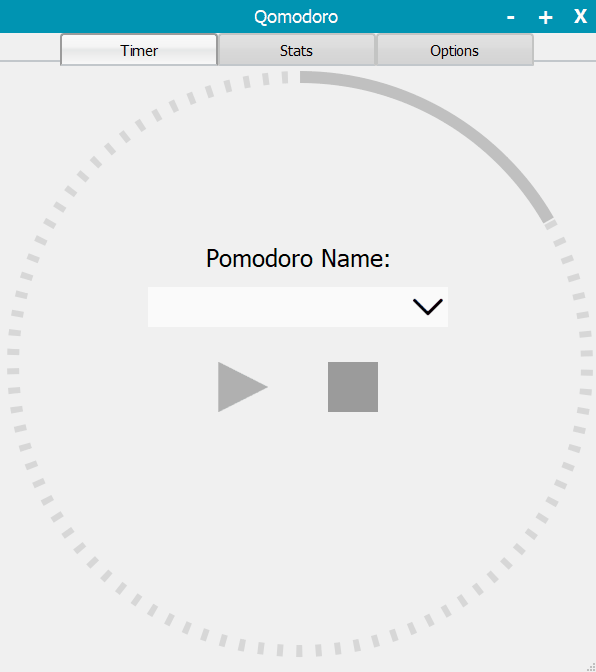
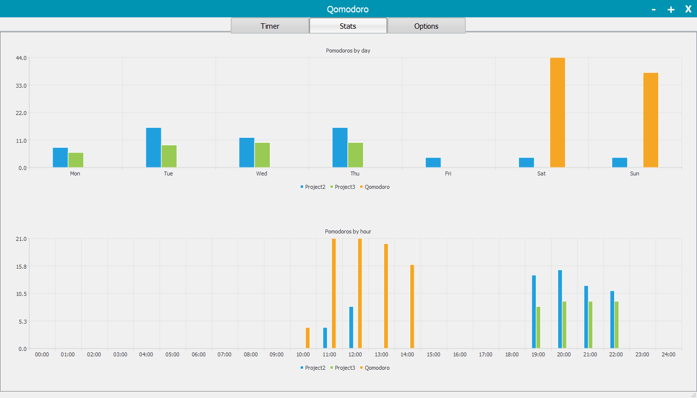

# Qomodoro

Qomodoro is a pomodoro timer and tracker. 

  

   

### Roadmap

You can see the known bugs and planned enhancements on our [issues list](https://github.com/mayuso/Qomodoro/issues).

### Installing

No installation needed, just download the latest version, extract the software and run `Qomodoro.exe``.

[Download the latest version here](https://github.com/mayuso/Qomodoro/releases)
